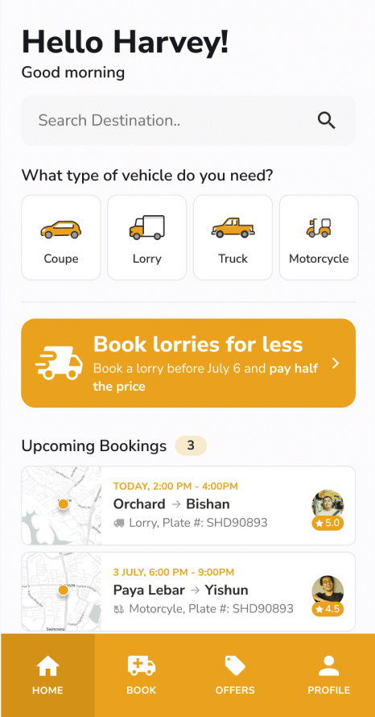

Objetivo
O objetivo desta atividade é desenvolver habilidades de construção de interfaces com React Native, aplicando conceitos de componentização, estilização com StyleSheet, e organização de layout.

Além disso, o estudante deverá exercitar a criatividade ao aplicar um tema visual personalizado inspirado em um dos seguintes contextos:

Time esportivo (futebol, basquete, etc.)
Anime
Série
Filme
Jogo
Outro tema cultural relevante
1. Estrutura da Interface
O estudante deve reproduzir fielmente a estrutura da tela apresentada na imagem:

2. Componentização
Criar pelo menos 5 componentes reutilizáveis, por exemplo:

Header
Booking
CustomButton
Footer
etc
Cada componente deve estar em um arquivo separado.

Avaliação
A interface deve se adaptar bem a diferentes tamanhos de tela (simulação básica).
Construção do layout (tamanho e disposição dos elementos) + componentização.
Tema + escolha de cores, icones e imagens selecionadas

Tecnologias Obrigatórias
React Native (com Expo ou CLI)
StyleSheet (não usar bibliotecas externas de UI)

O estudante deve entregar:
Código-fonte do projeto (excluir o diretório node_modules)
Print da tela desenvolvida (printscreen.png)
Descrição do tema escolhido (README.md)
Empacotar tudo em um único arquivo ZIP e entregar nesta atividade

Tema escolhido: Warframe (Console de Navegação do Orbiter)
Saudação: "Saudações, Tenno.
Busca: "Buscar Planeta ou Nodo...
4 Categorias (Tipos de Incursão): 
    Extermínio (Ícone de espada), 
    Sobrevivência (Ícone de relógio), 
    Defesa (Ícone de escudo), 
    Espionagem (Ícone de cofre).
Banner Promocional: "Alerta Tático do Void!" (Inicie Fendas do Void antes de amanhã e dobre seus Ducats).
Próximos Agendamentos (Missões na Forja/Navegação):
    Imagem à esquerda: Gráfico de um planeta ou constelação.
    Rota: "Orbiter -> Cetus (Terra)".
    Subtexto: "Fação: Grineer, 
    Nave: Liset".
    Perfil/Nota: Foto da Lotus, Ordis ou de um líder de Sindicato com a reputação.
Menu Inferior: 
    Orbiter, 
    Navegação, 
    Mercado, 
    Códex.
Cores/Estilo:Fundo quase preto, azul neon brilhante (ciano) e dourado brilhante (Prime). Muito uso de opacidade no StyleSheet.